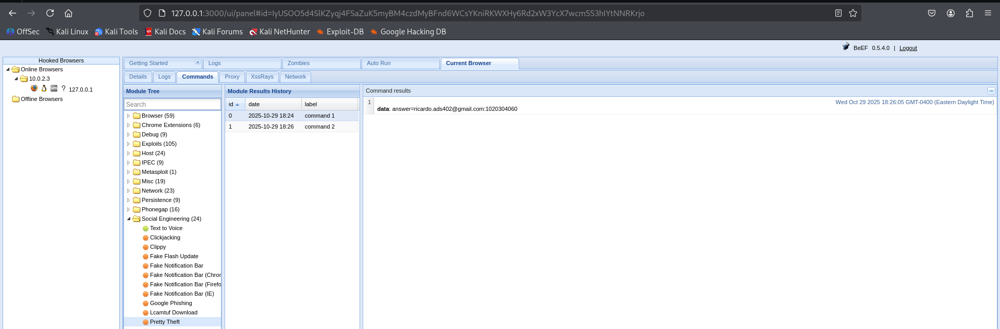

-# Relatório Cybersecurity - Aulas

## Aula 1

### Foco da aula
**Nessa aula, o professor Cainã trouxe uma visão geral dos temas, ferramentas e métodos que seriam abordados nas aulas de Cybersecurity.**

### Ferramentas e Aplicações
- **VirtualBox:** Virtualização de sistemas (ex.: Kali Linux).  
- **OWASP:** Projeto para boas práticas e aplicações seguras.  
- **Kali Linux:** Distribuição para auditoria e testes de segurança.

---

 

## Aula 2

**Tema:** *SQL Injection*  

**Ferramentas:** SQLmap, Burp Suite, browser DevTools  
**Técnica:** Injeção SQL (Error-based, Union-based, Blind)  
**Defesa:** Prepared statements / ORM / validação de entrada

- Explora falhas em consultas SQL concatenadas com entrada do usuário.  

### Etapas Realizadas

 

## Prevenção (Aula 2)
- Use **Prepared Statements** / consultas parametrizadas.  
- Valide entrada com **whitelist** (aceitar apenas formatos previstos).  
- Restrinja permissões do usuário do banco (**menor privilégio**).  
- Use **ORMs** quando aplicável.  
- Ative WAF e monitore logs para tentativas suspeitas.

---

 

## Aula 3

**Tema:** *XSS / BeEF*  

**Ferramentas:** BeEF, Burp Suite, browser DevTools  
**Técnica:** Cross-Site Scripting (Reflected, Stored, DOM)  
**Defesa:** Escape/encoding / CSP / validação e sanitização

- XSS permite que entradas maliciosas sejam executadas no navegador da vítima.  
- BeEF é usado para demonstrar pós-exploração via browser hook.

### Etapas Realizadas - XSS
**Inserindo scripts:**  
  
.png)

**Tirando site do ar:**  
.png)  
.png)

**Inserindo imagem:**  
.png)  
.png)

---

### BeEFF

- O BeEF (Browser Exploitation Framework) é uma ferramenta open‑source usada para explorar falhas em navegadores.

Em poucas palavras:

O atacante roda o BeEF num servidor e obtém uma interface web para controlar ataques.

Ele coloca um pequeno script JavaScript malicioso numa página ou envia por phishing.

Quando a vítima abre essa página, o navegador se conecta ao servidor BeEF e o invasor passa a controlar ações no navegador (muitos ataques usam XSS — Cross‑Site Scripting).

**Instalando BeEFF no Linux:**

**Pagina Inicial**

**Inserindo comando de redirecionamento:**

**Gerando pagina fake de login - Facebook:**

**Gerando pop-up para download de arquivo malicioso mascarado de plugin**

## Prevenção (Aula 3)
- **Escape/encode** todo dado antes de renderizar (HTML, JS, URL).  
- Use **Content Security Policy (CSP)** para limitar fontes de scripts.  
- Valide e **sanitize** entradas; para HTML permitido, use sanitizadores (ex.: HtmlSanitizer).  
- Utilize frameworks que fazem encoding automático (React, Angular, Razor).  
- Evite `innerHTML` e funções que interpretam HTML diretamente.

---

 

## Aula 4

**Tema:** *Command Injection*  

**Ferramentas:** Commix, Burp Suite, terminal (nc, curl)  
**Técnica:** Injeção de comandos do SO (uso de `;`, `&&`, `|`, fechamentos de string)  
**Defesa:** Não passar entrada ao shell / validação / lista branca

- Permite execução arbitrária de comandos no servidor quando entrada é concatenada a shells.

### Etapas Realizadas
**Comando inicial de exemplo:**  

**Explorando vulnerabilidades:**  
.png)  
.png)

## Prevenção (Aula 4)
- **Nunca** passe entrada do usuário diretamente para o shell.  
- Use APIs nativas em vez de `system()`/`exec()` quando possível.  
- Sanitizar com funções seguras (ex.: `escapeshellarg`) ou usar listas brancas.  
- Reduza privilégios do processo e isole com contêiner/chroot.  
- Monitore e registre execuções suspeitas.

---

 

## Aula 5

**Tema:** *LFI / RFI*  

**Ferramentas:** curl, wget, Burp/ZAP, shell scripts  
**Técnica:** Local File Inclusion (LFI) / Remote File Inclusion (RFI)  
**Defesa:** Validação de caminhos / desativar inclusão remota / restrição de uploads

- **LFI:** inclusão de arquivos locais no servidor por falta de validação (ex.: `../../etc/passwd`).  
- **RFI:** inclusão de arquivos remotos via URL, permitindo carregar/rodar código externo.

### Etapas Realizadas
**Realizando busca sobre os principais diretórios e pastas**  

**Identificando a URL para utilizar no Commix via ZAP**  
  

**Utilizando Command Injection no Commix para identificar os caminhos das pastas:**  
`commix -u http://10.0.2.15/bWAPP/commandi.php --cookie='PHPSESSID=e8rhpiohmnt06oup6ss3sahh04; security_level=0' --data='target=10.0.2.15&form=submit'`  
  

**Arquivos que servirão como backdoor para acesso**  

**Já com acesso, inserimos nosso Local File**  

**Voltando ao site conseguimos ter acesso aos arquivos com uma interface de navegação**  
  

**RFI — inclusão remota / uso de backdoor (r57)**  
  
  
  

## Prevenção (Aula 5)
- Valide e normalize caminhos; use **whitelist** de arquivos permitidos.  
- **Desative** inclusão remota (ex.: `allow_url_include = Off`).  
- Restringir uploads por tipo, extensão e tamanho; verifique conteúdo do arquivo no servidor.  
- Configure permissões corretas e isole aplicações (chroot/containers).  
- Monitore logs e bloqueie padrões de directory traversal.

---

 

## Aula 6

**Tema:** *DoS / DDoS*  

**Ferramentas:** hping3, slowloris, scripts de teste (em laboratório controlado)  
**Técnica:** Negação de serviço (volumétrico, protocolo, aplicação)  
**Defesa:** Rate limiting / balanceamento / mitigação em rede

- **DoS:** sobrecarrega um serviço a partir de um único ponto.  
- **DDoS:** ataque distribuído a partir de muitos hosts.

### Etapas Realizadas
**Comandos no terminal / testes controlados**  
- Acessando o usuário root  

- Comando hping para iniciar requisições em massa  
  

## Prevenção (Aula 6)
- Use **rate limiting** e thresholds por IP/endpoint.  
- Adote **CDN** e **load balancer** para absorver tráfego.  
- Habilite **SYN cookies** e proteções de camada de rede.  
- Implemente WAF e serviços especializados de mitigação DDoS.  
- Monitore tráfego e tenha um playbook de resposta.

---

